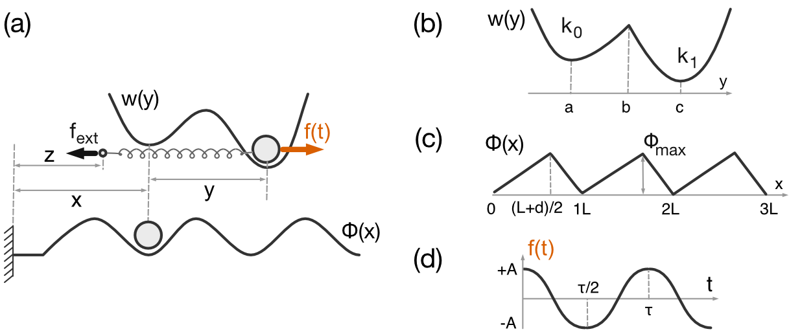
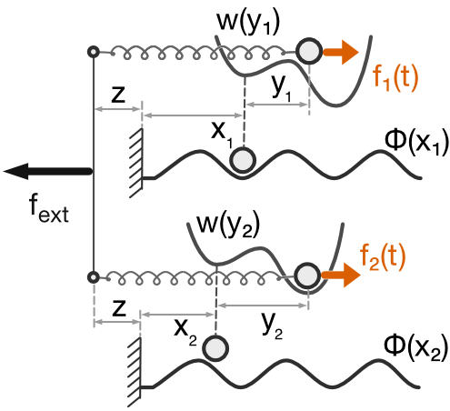

# The parallel collective model of N cooperative "Y-rocked" brownian ratchets with 3 degrees of freedom each

## General description

This is the simple routine, which generates the average trajectories of $N$ coupled brownian motors in soft device configuration - the system with fixed external load (or a cargo $f_{ext}$). A priori, each interacting Brownian motor has 3 degrees of freedom ${X_{i},Y_{i},Z_{i}}$ with $i=1,...,N$.

The $N$ motors are arranged in parallel. We should understand it as hypothesis of long-range interaction : the cammon rigid backbone; it's mean the same $Z^{t}$ for each motor.

The goal is to evaluate the corresponding ***force-velocity*** relation.  We want to measure the average velocity $\langle v_{z}\rangle$ of backbone position  $Z^{t}$ for given external load $f_{ext}$

### one single element



Each single motor is characterized by two internal variables:
- $X$ position of the motor head along the actin filament
- $Y$, which represents the power stroke (position of the lever arm)

and

- $Z$ which represents the position of common backbone.

The energy landscape reads

$G(X, Y, Z|f_{ext})  = \phi(X) + w(Y) + f (t)Y + \frac{1}{2}(X + Y - Z)^2 - f_{ext} Z$

where $\phi(..)$ is the space periodic function; $w(..)$ is the double-well potential and $f(t)$ is the time periodic function.

the system dynamics obeys the following system of stochastic differential equations (SDE):

$d X^{t} = −[\partial_{x}\phi(X^{t})d t + (Y^{t} + X^{t} - Z^{t})]dt + \sqrt{2D}dB^{t}_{x}$

$d Y^{t} = − [\partial_{y}w(Y^{t}) + f(t) + (X^{t} + Y^{t} - Z^{t})]dt + \sqrt{2D}dB^{t}_{y}$

$d Z^{t} = -\eta[-(X^{t} + Y^{t} - Z^{t}) - f_{ext}]dt + \sqrt{2D\eta}dB^{t}_{z}
$

where the parameter $\eta$ is the ratio of the drift coefficient associated with the backbone motion over the drift coefficient associated to the micro degrees of freedom.

### two-motors model



The SDE dynamical system of the two coupled motors is:

$d X^{t}_{1} = −[\partial_{x}\phi(X^{t}_{1}) + (X^{t}_{1} + Y^{t}_{1} - Z^{t})]dt + \sqrt{2D}dB^{t}_{x_{1}}$
$d Y^{t}_{1} = − [\partial_{y}w(Y^{t}_{1}) +f_{1}(t) + (X^{t}_{1} + Y^{t}_{1} - Z^{t})]dt + \sqrt{2D}dB^{t}_{y_1}$
$d X^{t}_{2} = −[\partial_{x}\phi(X^{t}_{2}) + (X^{t}_{2} + Y^{t}_{2} - Z^{t})]dt + \sqrt{2D}dB^{t}_{x_{2}}$
$d Y^{t}_{2} = − [\partial_{y}w(Y^{t}_{2}) + f_{2}(t) + (X^{t}_{2} + Y^{t}_{2} - Z^{t})]dt + \sqrt{2D}dB^{t}_{y_2}$
$d Z^{t} = -\eta[-(X^{t}_{1} + Y^{t}_{1} - Z^{t}) - (X^{t}_{2} + Y^{t}_{2} - Z^{t}) - f_{ext}]dt + \sqrt{2D\eta}dB^{t}_{z}$

where the parameter $\eta$ is the ratio of the drift coefficient associated with the backbone motion over the drift coefficient associated to the micro degrees of freedom.

### N motors in parallel

the system dynamics obeys the following system of stochastic differential equations:

$d X^{t}_{i}= −[\partial_{x}\phi(X^{t}_{i})d t + (X^{t}_{i} + Y^{t}_{i} - Z^{t}_{i})]dt + \sqrt{2D}dB^{t}_{x_{i}}$
$d Y^{t}_{i} = − [\partial_{y}w(Y^{t}_{i}) + f_{i}(t) + (X^{t}_{i} + Y^{t}_{i} - Z^{t}_{i})]dt + \sqrt{2D}dB^{t}_{y_i}$
$d Z^{t} = -\eta[-\sum^{N}_{i=1}(X^{t}_{i} + Y^{t}_{i} - Z^{t}_{i}) - f_{ext}]dt + \sqrt{2D\eta}dB^{t}_{z}$


# Numeric implementation

We focus on numerical approximations of SDEs. The Euler scheme is one of the standard schemes to obtain numerical approximations of solutions of stochastic differential equations and well adapted to our case.

## The Euler Scheme

Suppose we have an SDE of the form
$dX^{t} = \mu(t, X^{t})dt + dW^{t}$

where $W^{t}$ is a Brownian motion. We wish to simulate values of $X^{t}$ without knowing the exact form of associated its distribution. In this case we can simulate a discretized version of the SDE. We simulate a discretized process, ${X^0, X^{\Delta t}, X^{2\Delta t},..., X^{(n-1)\Delta t},X^{n\Delta t}}$, where $n$ is the number of discrete time steps, $\Delta t$ is a constant.  The most common scheme is the Euler scheme, this scheme satisfies


$X^{k\Delta t}_{n} = X^{(k−1)\Delta t}_{n} + \mu((k − 1)\Delta t, X^{(k−1)\Delta t}_{n})\Delta t + \sqrt{\Delta t} B^{k}_{n}$

where the $B^{k}_{n}$’s are $IID N(0, 1)$.  If we want to estimate the average $\langle f(X^{t} )\rangle$ using the Euler scheme, then for a fixed number of stochastic paths $N$ and discretization interval $\Delta t$ we have


$\langle f(X^{t} )\rangle = \frac{\sum^{n=N}_{n=1}f(X^{k\Delta t}_{n})}{N}$

## what is block ?

In numeric scheme each motor interacting in parallel called ***block***. Each block caracterised by the triplet ${X_{i},Y_{i},Z_{i}}$. Hovewer for the future developements, we introduced the 4th degrees reflecting the state of block memory $S_{i}$. Each block now represented by ${X_{i},Y_{i},Z_{i}, S_{i}}$ with $i = 1,...,N$, where $S$ here is always equal to ***True***. Latter $S$ can be used in the formalism with feedback pseudo-memory operator.

## Parameters

The code paramiters are stocked as *.json file in **Config.json**

- "deviceDescription": for instance always should be equal to ***"SoftDevice"***;
- "deviceConfiguration": interaction type should be ***"Parallel"***;
- "modelMemory": should be equal to ***false***,
- "model": equal to ***"y_ps"***
- "spacePeriodicPotential":  the space periodic part of model potential, we implemeted:
    - "SawToothPotential"
    - "SinusPotential"
- "alpha": numeric float, dimensionless parameter $\eta_x/\eta_z$, usually equal to 1;
- "beta": numeric float, dimensionless parameter $\eta_y/\eta_z$, usually equal to 1;
- "phiMax": numeric float, the maximum value of space periodic potential $\Phi$;
- "spacePeriod":  numeric float, of space periodic potential $\Phi$;
- "d": numeric float, wich control the assymetry of space periodic potential $\Phi$, for symmettric potential $d = 0$, not used for SinusPotential;
- "a": numeric float, the position of left minima of double-well potential $w$;
- "b": numeric float, the postion of the sadle point of double-well potential $w$;
- "c": numeric float, the position of right minima of double-well potential $w$;
- "k0": numeric float, the stifnness of left minima of double-well potential $w$;
- "k1": numeric float, the stifnness of right minima of double-well potential $w$;
- "interactionStiffness": numeric float, the stifnness of linear spring wich links Y and Z, here used only in Parallel form;
- "cargoMin": numeric float, conservative force imposed on the system in Soft Device; is the left boundary value of the interval
- "cargoMax": numeric float, conservative force imposed on the system in Soft Device; is the rigth boundary value of the interval
- "numberPoints": numeric integer, number of points in interval ***[cargoMin, cargoMax]***.
- "xD": numeric float, the X diffusion coefficient,
- "yD": numeric float, the Y diffusion coefficient,
- "zD": numeric float, the Z diffusion coefficient, not used here
- "colorNoiseFunctionName": we implemented so far:
    - "CosinusWave"
    - "SquareWave"
- "characteristicTimeColorNoise": numeric float, characteristic time period of color noise;
- "amplitudeColorNoise": numeric float, the amplitude value of color noise;
- "blockNumber": numeric  integer, number of motors used in experiment;
- "dt": numeric float, time step using in the Euler SDE solver ($\Delta t$);
- "dtSave": numeric integer , the used delay to save the trajectory path;
- "numberRealizations": numeric integer, the number of realization $N$ used in Euler scheme;
- "numberPeriodsTotalDuration":  numeric integer, the number of color noise time periods which estimates the total duration of experiment;
- "numberPeriodsToRelax": numeric integer, the number of color noise time periods which estimates the relaxation time expressed as multiple of characteristic color moise time period,
- "singleTrajectoryNumberSave": numeric integer, the single realization to save;
- "initialState": the distribution used to initiate the model dynamics:
    - "UniformDistribution";
- "file0": string, the data storage file name of average trajectorie;
- "file1":  string, the data storage file name of one particular single realization;
- "logsfile": string, the data storage file name for logs ourput "LOGS"

# 3rd party dependencies
* Jsoncpp
* Boost filesystem

# How to compile
Cmake is used to build project.

## On Windows
The dependency libs are pre-compiled with release flag and imported in the folder 'import'.

### prerequisite:
* cmake
* nmake (or Visual Studio)

1. Create a 'build' folder in current repository
```
$ mkdir build
$ cd build
```
2. Build project using cmake and generate nmake makefiles
```
$ cmake -G "NMake Makefiles" -DCMAKE_BUILD_TYPE=release ../N_driven_brownian_motors_3deg
```
3. Compile with nmake
```
$ nmake
```
4. Now you could run the executable
```
$ main_motor.exe
```

## On Linux
To be continued

## On MacOS
### prerequisite
brew install cmake make boost jsoncpp
1. Create a 'build' folder in current repository
```
$ mkdir build
$ cd build
```
2. Build project using cmake and generate nmake makefiles
```
$ cmake
```
3. Compile with nmake
```
$ nmake
```
4. Now you could copy 'Config.json' and the executable 'main_motor' in the desired folder and run the executable
```
$ ./main_motor
```